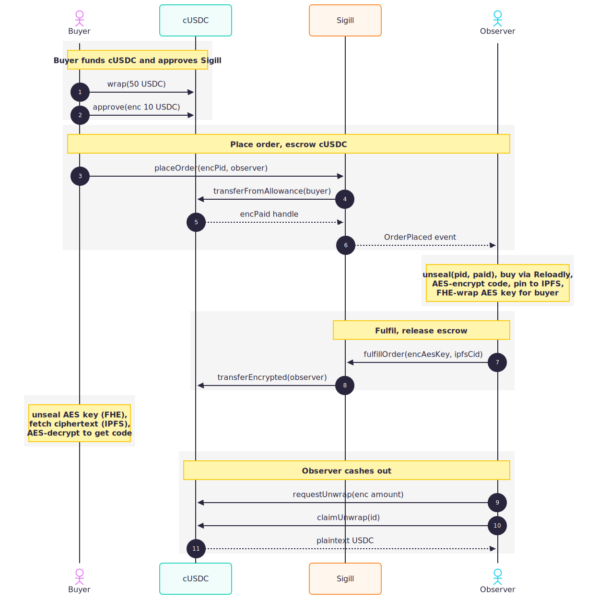

# Sigill

Private checkout using FHE on Base Sepolia. You buy a gift card, and nobody on-chain can see what you bought, how much you paid, or the code you got back.

Live at **[sigill.store](https://www.sigill.store/)**. App at **[app.sigill.store](https://app.sigill.store/)**. Walkthrough videos: **Wave 2** [youtu.be/g_jdN4tMQio](https://youtu.be/g_jdN4tMQio), **Wave 3** [youtu.be/bByseZNlY2o](https://youtu.be/bByseZNlY2o), **Wave 4** [youtu.be/W8zUIEEb8uo](https://youtu.be/W8zUIEEb8uo), **Wave 5** [youtu.be/Ucd8nTsQXkY](https://youtu.be/Ucd8nTsQXkY).

**Deployed on Base Sepolia**

- Sigill: [`0x6EabB…DD186`](https://sepolia.basescan.org/address/0x6EabB2fB2b32F1988e4a3B89543Ce1a2117DD186)
- cUSDC (ConfidentialERC20): [`0x7c60…a5eB`](https://sepolia.basescan.org/address/0x7c60BC6c5b4aA568b854173c1cA3A2810A75a5eB)
- USDC (Mock on Base Sepolia): [`0xe29D…424F`](https://sepolia.basescan.org/address/0xe29d70400026d77a790a8e483168b94d6e36424f)

<p>
  Powered by
  <a href="https://fhenix.io">
    <picture>
      <source media="(prefers-color-scheme: dark)" srcset="packages/landing/public/fhenix.svg">
      
    </picture>
  </a>
</p>

## Why Sigill?

> **si · gill** *(noun)*, a seal pressed in wax to keep private correspondence private.

Kings pressed sigills onto letters so couriers couldn't read them. Monks pressed them onto ledgers so the wrong eyes couldn't skim. A sigill was a promise: this is sealed, and opening it without permission means you broke the seal.

That promise mostly vanished from money. Every transaction is a postcard now. The amount, the counterparty, every downstream address, all of it public forever. So we went and made a new seal, pressed in ciphertext instead of wax. It still means the same thing. What you bought is yours, and nobody opens the envelope but you.

## The idea

On-chain payments leak everything. The amount, the counterparty, and every address it touches afterwards. Sigill hides all of that.

Your browser seals the inputs with FHE. You wrap some USDC into a confidential token (cUSDC), approve the checkout contract for an encrypted allowance, and place an order. A bonded observer fulfils that order without ever learning a wallet-visible secret, and the gift card code gets delivered through a side-channel only you can open.

**The flow**

1. Buyer wraps USDC into cUSDC (a confidential ERC-20).
2. Buyer encrypts productId + amount client-side, then calls `quoteOrder(encProductId, observer, encAmount)`. Both fields enter as `InEuint64` so neither appears in calldata as plaintext. The contract computes the encrypted total (`price + observerFee + 0.25% platformFee`), stores it under a `pendingId` with a 5-minute TTL, and emits the handle.
3. Buyer unseals the quoted total locally, re-encrypts it as the cUSDC `approve` amount, and submits the approve.
4. Buyer calls `confirmOrder(pendingId)`. Sigill pulls the allowance and FHE.eq-verifies it against the stored quote. Mismatch zeros the escrow and refunds in-place silently.
5. The picked observer has FHE decryption permission on just the product ID and the paid amount. They confirm the payment covers the price, buy the card from Reloadly, AES-encrypt the code, pin the ciphertext to IPFS, and FHE-wrap the AES key so only the buyer can open it. The escrowed cUSDC splits at `fulfillOrder`: observer gets `encPaid - platformFee`, treasury gets `platformFee`, both encrypted transfers in the same tx.
6. Buyer unseals the AES key through FHE, fetches the ciphertext from IPFS, AES-decrypts, reads the code locally. Observer later `unwrap`s their cUSDC back to plain USDC whenever they want.

Explorer only ever sees opaque handles. IPFS only ever sees gibberish. The amount that moved between buyer and observer is an encrypted balance update, so nobody watching the chain can tell how much changed hands.

## What's in the monorepo

```
packages/
  contracts/   Hardhat + Solidity + Fhenix CoFHE (multi-observer Sigill,
               ConfidentialERC20)
  landing/     Next.js marketing site
  app/         Next.js dApp (wagmi + RainbowKit + @cofhe/sdk/web)
  observer/    Node daemon that watches OrderInProccessed / OrderInQueued
               + UnwrapRequested, decrypts off-chain via @cofhe/sdk/node,
               buys from Reloadly, fulfils on-chain
```

pnpm workspace. Node 20+, pnpm 9+.

## Setup

```bash
pnpm install
cp packages/contracts/.env.example   packages/contracts/.env
cp packages/app/.env.local.example   packages/app/.env.local
```

What you'll need to fill in:

| File | Keys | Where to get them |
|---|---|---|
| `packages/contracts/.env` | `PRIVATE_KEY`, `OBSERVER_PRIVATE_KEY`, `OBSERVER_PRIVATE_KEY_2` | any Base Sepolia wallets funded with test ETH (one deployer + one or two observers) |
| " | `USDC_ADDRESS` | prefilled, Circle's Base Sepolia USDC. Faucet at [faucet.circle.com](https://faucet.circle.com) |
| " | `RELOADLY_CLIENT_ID` + `_SECRET` | [reloadly.com](https://reloadly.com) Sandbox mode (test cards). Live cards: set `RELOADLY_LIVE_CLIENT_ID` + `_SECRET` + `RELOADLY_ENV=live` instead, see `packages/observer/src/giftcard.ts`. |
| " | `PINATA_JWT`, `PINATA_GATEWAY` | [pinata.cloud](https://pinata.cloud), API Keys |
| " | `BASE_SEPOLIA_RPC_URL` | the public endpoint is flaky, prefer Alchemy or Infura or QuickNode |
| `packages/app/.env.local` | `NEXT_PUBLIC_SIGILL_ADDRESS`, `NEXT_PUBLIC_CUSDC_ADDRESS`, `NEXT_PUBLIC_USDC_ADDRESS` | populated automatically by `make deploy` (via `scripts/sync-env.mjs` reading `cUSDC.underlying()` as truth for USDC) |
| `packages/observer/.env` | `OBSERVER_FEES` (optional, cUSDC base units, 6 decimals) | flat per-order fee the relay charges. Default `0`. Synced on every daemon startup via `setObserverFees`. obs2 reads `OBSERVER_FEES_2` from `packages/contracts/.env` instead. |
| `packages/app/.env.local` | `SITE_PASSWORD` (optional) | HTTP Basic Auth gate on the whole dApp via `src/middleware.ts`. Unset = no gate. Set in the hosting env when you want a staged preview behind a single shared password. |

Buyer wallet needs at least 50 USDC (Circle faucet hands out 10 at a time, so run it a few times). Each observer wallet needs at least 0.02 ETH (0.01 bond + gas). The second observer is optional; leave `OBSERVER_PRIVATE_KEY_2` unset to skip it.

## Running stuff

Everything runs from the repo root via `make`. See `make help` for the full list.

```bash
# One-shot: install deps, deploy contracts, register both observers, then
# launch dApp + 2 observers in parallel (Ctrl-C stops everything).
make all

# Or piecemeal:
make setup        # install + deploy + register
make run          # dApp on :3000 plus observer #1 + #2 in parallel
make run-app      # just the dApp
make run-obs1     # just observer #1
make run-obs2     # just observer #2 (uses OBSERVER_PRIVATE_KEY_2)
make register     # idempotent: bond observers that aren't bonded yet
make deploy       # fresh deploy + sync addresses into per-package .env.local
```

`make deploy` runs `hardhat deploy-sigill` (deploys `ConfidentialERC20` + `Sigill`) then `scripts/sync-env.mjs`, which writes the new addresses into `packages/{app,observer}/.env.local`. `cUSDC.underlying()` is queried directly to pick the right USDC address rather than trusting the deployments JSON, which can drift if you deployed against a different USDC than the one currently wrapped.

`make register` runs `packages/contracts/scripts/register-observers.mjs`, which reads both observer private keys from `packages/contracts/.env` and bonds whichever aren't already at ≥ 0.01 ETH. Safe to re-run.

If you only want the marketing site:

```bash
pnpm landing:dev
```

## What actually stays private

| | Where | Leaks? |
|---|---|---|
| Transaction happened | on-chain | yes |
| Buyer / observer addresses | on-chain | yes |
| Observer bond (0.01 ETH, fixed) | on-chain | yes |
| USDC wrap amount | on-chain | yes (pre-order, unavoidable) |
| **cUSDC payment amount** | on-chain | **no, encrypted balance update** |
| **Product ID** | on-chain | **no, FHE, observer-only** |
| **AES key** | on-chain | **no, FHE, buyer-only** |
| **Gift card code** | IPFS | **no, AES, needs the FHE-unsealed key** |
| IPFS CID | on-chain | yes, but useless without the key |

The wrap step is the only place the buyer touches plaintext USDC. After that, everything flows as encrypted `euint64` balances and allowances.

## Architecture



## The contracts

Two contracts do the work.

**[ConfidentialERC20.sol](packages/contracts/contracts/ConfidentialERC20.sol)** is a minimal ERC-7984-like wrapper over plaintext USDC.

- `wrap(uint64)` pulls plaintext USDC and credits an encrypted `euint64` balance.
- `requestUnwrap(InEuint64)` then `claimUnwrap(id)` is a two-step async burn. Debits the encrypted balance immediately, and later transfers plaintext USDC once the FHE decryption completes.
- `transfer` / `approve` / `transferFrom` operate on encrypted amounts. Insufficient funds silently clamp to 0 rather than revert, which is the standard ERC-7984 semantic and preserves privacy (reverts leak information).
- `transferFromAllowance(from, to)` is the primitive Sigill uses. It pulls the entire encrypted allowance without needing a fresh `InEuint64` passed through an intermediary, which avoids the zkv signature-binding mismatch that happens under nested `msg.sender`. The allowance zeroes on use, so escrow is replay-safe.

**[Sigill.sol](packages/contracts/contracts/Sigill.sol)** is the checkout. Most of the logic lives in [Observer.sol](packages/contracts/contracts/Observer.sol), the abstract base it inherits from — observer registry, per-observer slot capacity, the order queue.

```solidity
struct Order {
  address buyer;
  address observer;
  euint64 encProductId;   // what to buy, observer decrypts
  euint64 encPaid;        // cUSDC escrowed, observer decrypts to verify
  euint64 platformFee;    // 0.25% cut split to treasury at fulfillment
  euint128 encAesKey;     // AES-128 key for the code, buyer decrypts
  string ipfsCid;         // pointer to AES-encrypted code
  uint256 deadline;
  Status status;          // Pending | Processing | Fulfilled | Refunded | Rejected | Queued
}
```

Checkout is two-step. `quoteOrder(encProductId, observer, encAmount)` takes both productId and amount as `InEuint64` ciphertexts so neither value appears in calldata as plaintext (mempool watchers + archive nodes see opaque handles instead of `productId=1, amountUsdc=2_000_000`). The contract computes the encrypted total (`price + observerFee + platformFee`), stores it under a `pendingId` with a 5-minute TTL, and emits `OrderQuoted(pendingId, buyer, observer, productIdHandle, expectedTotalHandle, expiresAt)`. The buyer unseals the total, re-encrypts as the cUSDC approve amount, then calls `confirmOrder(pendingId)`. `confirmOrder` pulls the allowance via `transferFromAllowance`, FHE.eq-verifies it against the stored quote, and silently zeros the escrow plus refunds in-place on mismatch. The buyer can't tamper because the comparison value is contract-computed. Catalog enforcement (which productIds are real) moves to the observer's `PRODUCT_MAP` — unknown products get rejected at fulfillment with the buyer's escrow refunded.

`confirmOrder` emits **`OrderInProccessed`** when the picked observer had a free slot (status `Pending`) or **`OrderInQueued`** when waitlisted behind an earlier order on the same observer (status `Queued`). Once the head order clears, the next queued one auto-promotes to `Pending` with a fresh deadline.

Three settlement paths. `fulfillOrder` means the observer delivered, escrow splits to observer (`encPaid - platformFee`) and treasury (`platformFee`) in the same tx (status `Fulfilled`). `rejectOrder` is the honest-decline path, escrow returns to the buyer and the bond stays intact (status `Rejected`). `refund` is what the buyer calls after the 10-minute deadline passes; it works on both `Pending` and `Queued` orders and slashes 50% of the observer's bond (status `Refunded`).

Observers publish a flat per-order fee at registration (`registerObserver(uint64 fees)`) and can update it any time via `setObserverFees`. Fees are plaintext `uint64` on the `ObserverDetails` struct so the dApp can render them directly in the relay picker.

Access control uses `FHE.allow(handle, address)` per value. The observer gets ACL on `encProductId` and `encPaid`. The buyer gets ACL on `encAesKey`. That's it.

## The observer

The observer is the off-chain execution layer. It watches the chain, decrypts what it's been granted ACL on via `@cofhe/sdk/node`, and settles gift-card orders. It also acts as the trusted unwrapper for cUSDC (the recipient can self-claim too; the observer is a fallback).

It's a stateless Node process. Each poll iteration it re-checks on-chain status, so dedupe across restarts is free and there is no database.

Sigill supports multiple observers in parallel. Each has a configurable slot count (capacity for active orders); buyers pick which observer fulfils their order at `placeOrder`. If the picked observer is at capacity, the order is `Queued` and starts the moment the head order clears. The `make all` target runs two observers side-by-side using `OBSERVER_PRIVATE_KEY` and `OBSERVER_PRIVATE_KEY_2`.

**At startup**, the daemon calls `setObserverFees(OBSERVER_FEES)` on Sigill so the on-chain fee always matches whatever the operator has in their `.env`. A restart is enough to update the published fee.

**What the daemon does each loop**

1. `provider.getBlockNumber()` to find head.
2. `sigill.queryFilter(OrderInProccessed, …)` and `sigill.queryFilter(OrderInQueued, …)` in parallel, both filtered by this observer's address.
3. `cUSDC.queryFilter(UnwrapRequested, …)` if this wallet is the registered unwrapper.
4. For each `Pending` order: decrypt `encProductId` + `encPaid` via `client.decryptForView(...).withPermit()`, validate `paid ≥ unitPrice` (otherwise `rejectOrder`), buy the card from Reloadly, AES-128-GCM the code, pin the ciphertext to IPFS, FHE-encrypt the AES key, call `fulfillOrder(id, encAesKey, cid)`. `Queued` orders are skipped on this iteration; they'll show up as `Pending` once the head clears.
5. For each pending unwrap: decrypt the debit handle, call `claimUnwrap(id, plain)`.

**Run it**

```bash
# from repo root, after make setup
make run-obs1                  # daemon, uses OBSERVER_PRIVATE_KEY
make run-obs2                  # daemon, uses OBSERVER_PRIVATE_KEY_2
# or both in parallel along with the dApp:
make run

# manual cash-out (unwrap entire sealed cUSDC balance):
pnpm --filter @sigill/observer run unwrap
```

Reloadly and Pinata creds are both mandatory. The daemon refuses to start without them.

**Observer docs**

- Package README with run instructions and credential requirements: [packages/observer/README.md](packages/observer/README.md).
- Full multi-observer network design (bond / slash / reputation / dispute layer): [docs/Decentralized Observer System.md](docs/Decentralized%20Observer%20System.md).

## Fees

Wave 4 ships the first half of the [fee model draft](docs/fee-model.md): a flat 0.25% platform fee deducted at fulfillment and routed to a treasury address, plus a per-observer flat fee the relay publishes at registration and the buyer sees in the picker before placing the order. The slashing-to-buyer payout and bond-scales-with-order-size pieces are still proposals, captured in [docs/reputation-and-slashing.md](docs/reputation-and-slashing.md) as the Wave 5 planning surface.

## Catalog

The dApp ships eight brands in the picker. Only one is wired on-chain right now; the rest are display-only ("Coming soon") to signal where the catalog is going without claiming what isn't built yet.

- **App Store & iTunes** — live, routes to Reloadly product 21 ($2 range).
- **Netflix, Spotify, Google Play, Xbox Live, PlayStation, Steam, Roblox** — coming soon. The wizard disables them in the picker and the observer's `PRODUCT_MAP` doesn't carry their Reloadly IDs, so any order that snuck past the UI would be rejected at fulfillment with the buyer's escrow refunded same-tx.

To activate another brand, add its Reloadly product ID to `PRODUCT_MAP_LIVE` in `packages/observer/src/giftcard.ts` and flip `comingSoon: false` in the matching `PRODUCTS` entry on the app + landing. (Catalog enforcement lives off-chain on the observer now — the contract can't see which productId was picked because it arrives as an `InEuint64` ciphertext, so there's nothing to set on Sigill.)

## Stack

- **Contracts**: Solidity + [Fhenix CoFHE](https://github.com/FhenixProtocol), Hardhat
- **Gift cards**: [Reloadly](https://reloadly.com) — sandbox by default, production (real Apple / Netflix / etc. codes) when `RELOADLY_ENV=live`
- **Storage**: IPFS via [Pinata](https://pinata.cloud)
- **Network**: Base Sepolia
- **Frontend**: Next.js, Tailwind v4, shadcn, wagmi + RainbowKit, @cofhe/sdk/web
- **Observer**: Node (tsx), ethers v6, @cofhe/sdk/node
