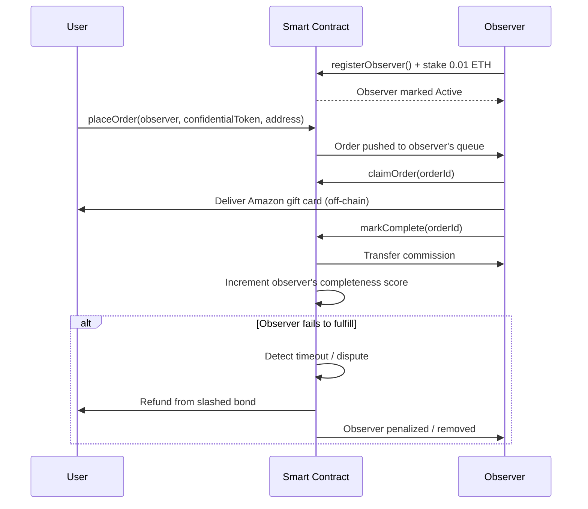

# Decentralized Observer System

## Overview

The **Observer** is a decentralized off-chain node that fulfills user orders for Amazon gift cards.

At a high level:

- A user places an order on-chain and includes a **confidential payment token** (encrypted using **Fhenix FHE**).
- An observer picks up the order, accepts the confidential payment, fulfills the order off-chain (buys and delivers the gift card), then finalizes the order on-chain.
- In return, the observer earns a **commission**.

Observers are the execution layer of the system. To avoid a single point of failure, the protocol is designed as a **multi-observer network** where anyone can run an observer node—similar to running an Ethereum node.

---

## Why a multi-observer network?

Relying on a single observer introduces major risks:

- **Single point of failure**: if the observer goes offline, order fulfillment halts.
- **Censorship risk**: one operator can selectively refuse to fulfill certain orders.
- **No competition**: users cannot choose better fees or service quality.

A multi-observer model addresses these by allowing multiple independent operators to register, stake collateral, and compete on reliability and price.

---

## Responsibilities

An active observer is expected to:

1. Monitor the smart contract for new orders assigned to its queue.
2. Accept the confidential token payment.
3. Fulfill the order off-chain by delivering the Amazon gift card to the user’s address.
4. Mark the order as complete on-chain to claim commission.
5. Maintain reasonable uptime and honest behavior to preserve reputation.

---

## Lifecycle

### 1) Registration

Anyone can become an observer by:

1. Running the observer node/software.
2. Calling the on-chain `registerObserver()` function.
3. Locking a **security bond of 0.01 ETH**.

After the bond is locked and the transaction is confirmed, the observer becomes **Active** and discoverable.

### 2) Active operation

While active, an observer:

- Receives a **dedicated on-chain FIFO order queue**.
- Processes orders **sequentially**.
- Earns commission for each successfully completed order.
- Builds reputation via a **completeness score**.

### 3) Exit

An observer can leave the network by calling the exit function.

If there are:

- no pending orders, and
- no unresolved disputes,

then the **0.01 ETH bond is returned in full**.

---

## Observer selection (user-facing)

When placing an order, the user selects an observer. The UI surfaces two primary decision metrics:

| Metric | Description |
| --- | --- |
| **Completeness score** | Ratio of successful fulfillments to total assigned orders. Higher implies higher reliability. |
| **Commission fee** | Fee charged by the observer per fulfilled order. Lower is cheaper, but may correlate with lower service quality. |

This creates a market where observers compete on **reliability** and **price**, and users can choose the tradeoff they prefer.

---

## Security bond & slashing

### Why a bond?

The **0.01 ETH bond** is “skin in the game.” It creates an economic incentive to fulfill orders correctly. Without collateral, a malicious actor could register, accept payments, and disappear.

### Slashing conditions

The bond may be **slashed** (partially or fully) and redirected to affected users if the observer:

- Fails to fulfill an assigned order within the allowed timeframe.
- Accepts the confidential token but does not deliver the gift card.
- Is detected engaging in suspicious/adversarial behavior (e.g., via on-chain evidence, disputes, or protocol-defined monitoring).

### Refund flow

When slashing is triggered, the locked bond (or a portion of it) is transferred to the affected user(s) as a refund. This protects users even if an observer misbehaves.

### Clean exit

If the observer exits cleanly (no pending orders or disputes), **no slashing occurs** and the full bond is returned.

---

## Commission model

- Each successfully fulfilled order pays the observer a **commission**.
- The **commission rate** is set by the observer at registration and is publicly visible.
- A separate **protocol fee** may exist, but it is independent of the observer’s commission.

---

## End-to-end flow

